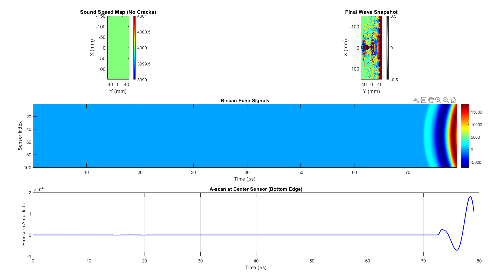
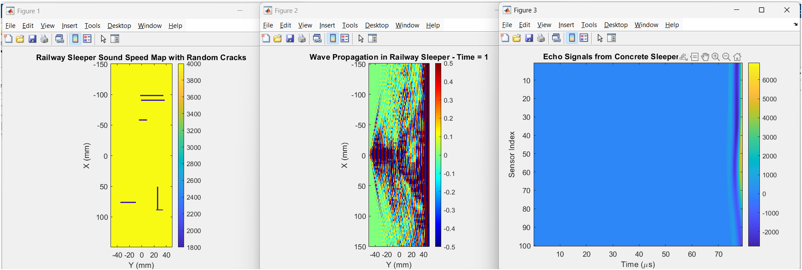
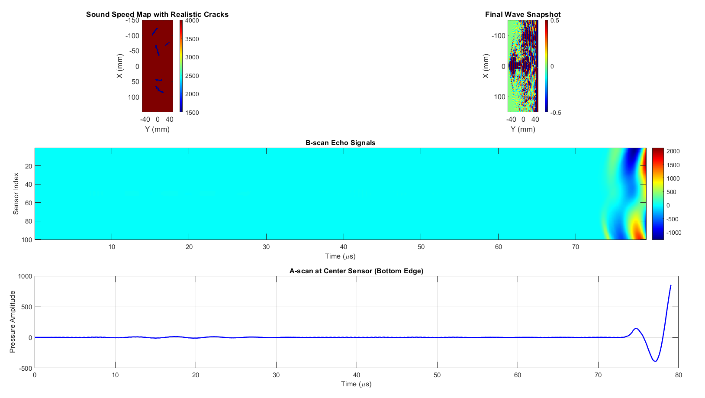

# Bottom-Scanning Ultrasonic NDT System for Railway Sleeper Blocks

## Overview
This project implements a MATLAB-based simulation and concept design for a **Bottom-Scanning Ultrasonic Non-Destructive Testing (NDT) System** for railway sleeper blocks.  
The design is inspired by printer-style scanning, where an array of ultrasonic probes moves across the underside of the sleeper to detect internal cracks and voids.

The MATLAB simulation uses the **k-Wave Toolbox** to model ultrasonic wave propagation in concrete, both with and without cracks, and visualizes results as **A-scan** and **B-scan** plots.

---

## Key Features
- **Simulation Scenarios:**
  - *NoCrack.m*: Baseline — defect-free sleeper block
  - *Crack.m*: Random cracks with adjustable parameters
  - *realCrack.m*: Realistic random cracks for advanced defect simulation
- **Ultrasonic NDT Visualization:**
  - Real-time **wave propagation animation**
  - **A-scan**: Pressure amplitude vs. time
  - **B-scan**: Echo signals along the sensor array
- **Architecture & Workflow Documentation**
  - Hardware and software specifications
  - Process flow diagrams using Mermaid (renders on GitHub)
- **Ready for Future Expansion**
  - Can be extended to integrate with real ultrasonic hardware

---

## System Architecture

### Hardware Components (Prototype Design)
- **Ultrasonic Probes:** 50–250 kHz pulse-echo type, 1 mm resolution
- **Motorized Scanner Rail:** Linear actuator with 0.1 mm step resolution
- **Coupling Medium:** Water immersion or coupling gel
- **Controller:** Digital ultrasonic flaw detector with real-time display
- **Fixture Base:** Vibration-isolated sleeper holder
- **HMI:** Touchscreen for test setup and results

### Software Features
- Real-time A-scan and B-scan visualization
- Automated defect detection algorithm
- Report export in PDF/CSV

**See** [`docs/ARCHITECTURE.md`](docs/ARCHITECTURE.md) for diagrams and full details.

---

## Example Results
- **No Crack**

- **Random Cracks**

- **Realistic Cracks**

## Credits
- Author: Shubham Asole
- Toolbox: k-Wave MATLAB Toolbox

